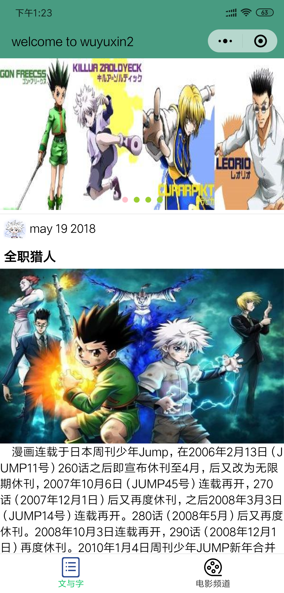
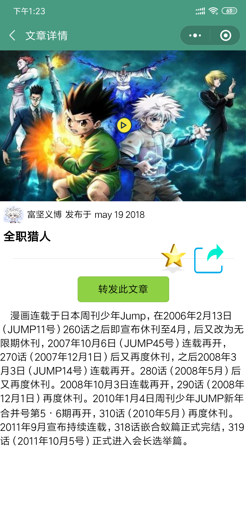
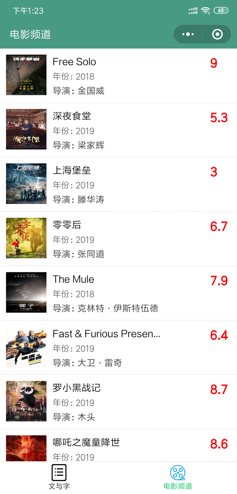

# wechat-mini-program-demo
微信小程序初入门，涵盖了适配方案、数据绑定、自定义事件机制、模板使用、列表渲染、本地缓存、背景音乐播放及发送ajax请求等内容。
- 感谢[尚硅谷的公开课](https://www.bilibili.com/video/av29426039/)
- 感谢[b站同学](https://github.com/captainLuo/wxstudy)提供的json数据

### 效果图如下：

